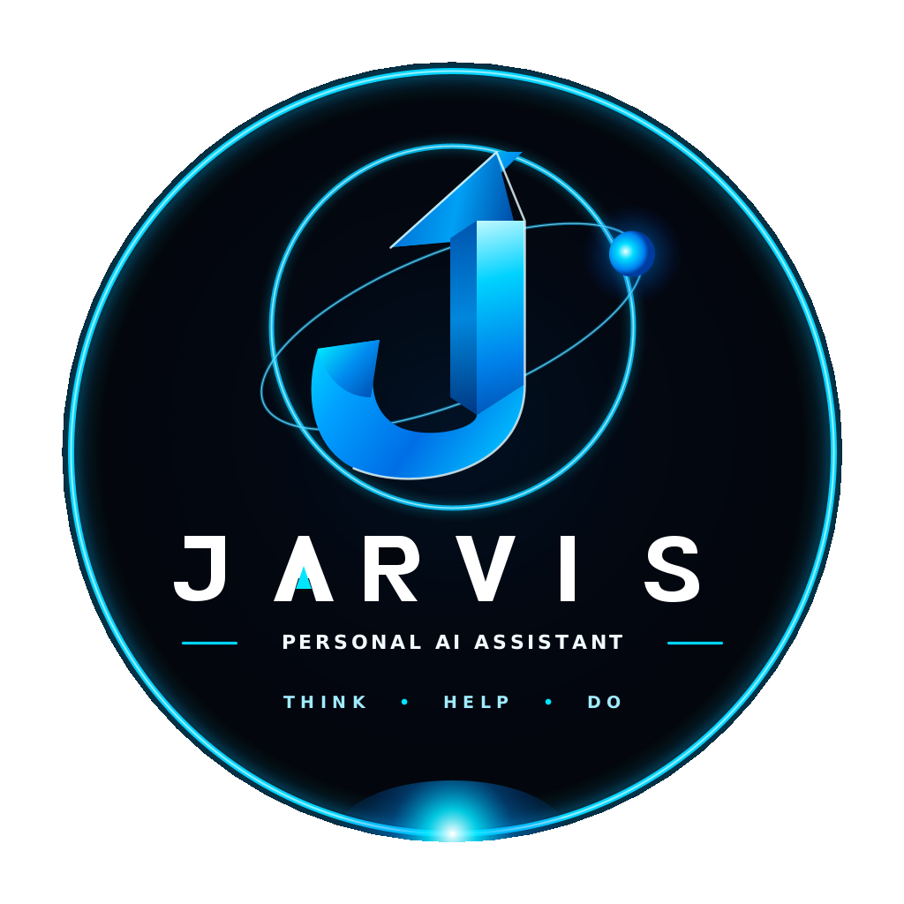

# 🤖 JARVIS — Autonomous Cybernetic AI Operating System for Android

<p align="center">
  
  <br>
  <b>Just A Rather Very Intelligent System</b>
  <br>
  <i>Personalized Next-Generation AI Operating System with Real-Time Hologram Core & Edge Intelligence</i>
</p>

---

## ⚡ Highlights & Architecture

- **🔮 Holographic 3D Core Visualizer**: Cybernetic Arc Reactor with multi-ring reactive gyroscopes and real-time audio FFT waveform rendering.
- **🎙️ Real-Time Voice Intelligence**: Continuous wake engine with acoustic barge-in detection, low-latency conversational audio, and dynamic Stark sound effects.
- **🧠 Autonomous Decision Engine**: 
  - Dynamic Tool Execution (Search, Device Actions, App Launching, Weather, Notes)
  - Memory & Recall engine with SQLite local persistence
  - Proactive notification screening and summarization
- **🛡️ Ironclad Privacy & Security**: Biometric app lock, local encrypted storage, and granular permissions control.
- **📱 Android Deep System Bridge**:
  - Direct dialer, SMS, and WhatsApp intent dispatching
  - System diagnostics (CPU, RAM, Battery, Thermal state)
  - Screen Context Inspector with sensitive data redaction

---

## 📥 Download APK

Get the latest pre-compiled debug APK directly from GitHub Releases:

👉 **[Download Latest JARVIS APK](https://github.com/itsmurselimsk-jpg/jarvis-agent/releases/latest)**

---

## 🛠️ Build from Source

```bash
# Clone repository
git clone https://github.com/itsmurselimsk-jpg/jarvis-agent.git
cd jarvis-agent

# Build Debug APK
./gradlew assembleDebug

# Output APK will be at:
# app/build/outputs/apk/debug/app-debug.apk
```

---

## 📜 License
Developed with ❤️ by **itsmurselimsk-jpg**. All rights reserved.
